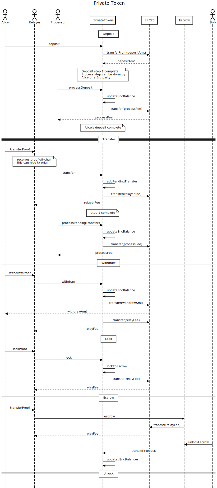

# Private-token

Token with private balances using zkSNARKs and Homomorphic Encryption, inspired by [Zeestar](https://files.sri.inf.ethz.ch/website/papers/sp22-zeestar.pdf) and [Zether](https://crypto.stanford.edu/~buenz/papers/zether.pdf), implemented in [Noir](https://noir-lang.org/) (and Rust).

You can read the slides presenting the final project [here](https://docs.google.com/presentation/d/1SDTOthvK1xCXcoKlILIKCobktrDf_ibPUbHtykAQfpc/edit?usp=sharing).

## Quick description

This project is an implementation of a token on Ethereum with private balances, i.e all the balances are publicly stored on the Ethereum blockchain in an encrypted format, but only the owner of an Ethereum account is able to decrypt their own balance. This is possible thanks to the improved expressiveness allowed by homomorphic encryption on top of zkSNARKs, allowing a party **A** to compute over encrypted data owned by *another* party **B** i.e **A** can add encrpyted balances owned by **B** without needing any knowledge of those balances.

Pros:

- Transfer amounts are encrypted
- Accounts are decoupled from eth accounts
- Can be used with something like stealth addresses to make single use addresses easy and more private
- It's expensive, ~500k gas for proof verification, probably best to use on L2
- Auditable. everyone can see the interaction history, tracing back to deposits into the contract. If users receive tainted funds, they can burn them and can generate proofs of burn for that amount.
- users can submit proofs to a relayer network to post transactions for them, so they don't doxx themselves by using a funded Ethereum account. this requires adding a fee.
- Can be used with any erc20 token
- Option to provider a relayer fee, paid from the encrypted amount, that incentivizes anon third-parties to submit transfer or withdraw transactions on behalf of the user--this helps maintain anonymity
- Accounts can be locked to a contract. The contract that an account is locked to can conditionally use an account's funds. A user can lock their funds in a contract and the contract only unlocks them after some condition is met (ie with a zk proof of something). Some things you could build with this:
  - A sealed bid auction.
  - Private, p2p trustless exchange (something like [zkp2p](https://zkp2p.xyz/), but with amounts hidden)
  - Credit to [Zether](https://crypto.stanford.edu/~buenz/papers/zether.pdf) for this idea

Cons:

- Users have to use a new Private key. The pain can be mitigated by generating a key from an ethereum signature, like zk.money.
- Deposits and transfers are a 2 step process. This allows multiple people to send the same account funds in the same block, but requires a processing step. Senders can incentivize the process of this step so it still feels like a 1 step process. 
- limit of ~1 trillion tokens per contract (~11 billion if using 2 decimals)

Sequence Diagram:



The current model is the following:

After the deployment of the new Private Token, transfers between users can occur. 

The Baby Jubjub private key, which corresponds to the public key, should be safeguarded diligently by each registered user. If lost, the user will no longer have access to their funds. anyone with the private key can spend funds.

# Requirements
* `nargo` version 0.10.5 **Important**
* `node` version 18 or later
* `cargo` v1.73.0-nightly
* `hardhat` v2.17.2
* `just 1.14.0` (install it via `cargo install just`)

# To run the tests : 

Clone the repo, install the requirements, and then just run : 
```
just test
```

# To deploy the front-end locally : 

Clone the repo, install the requirements, and then create 2 `.env` files in the `hardhat/` and `frontend` directories. Fill them with the same keys as in the corresponding `.env.example`files placed in the corresponding directories. `CHAINNAME`should be set to `sepolia`in `hardhat/.env`and a valid Sepolia RPC URL given for `SEPOLIA_RPC_URL`. Then run the following commands in this order : 
```
just wp
```
```
just ds
```
```
just release
```

# Warning
Do not use in production, this was not audited and done as a final project for the [zkCamp Noir bootcamp](https://www.zkcamp.xyz/aztec).